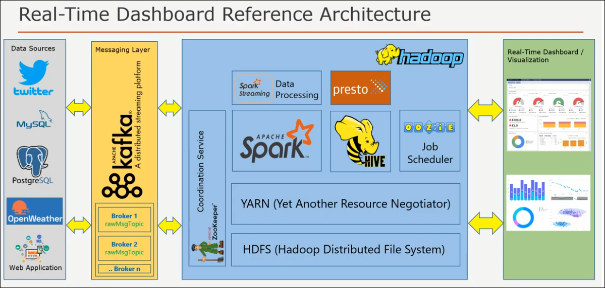
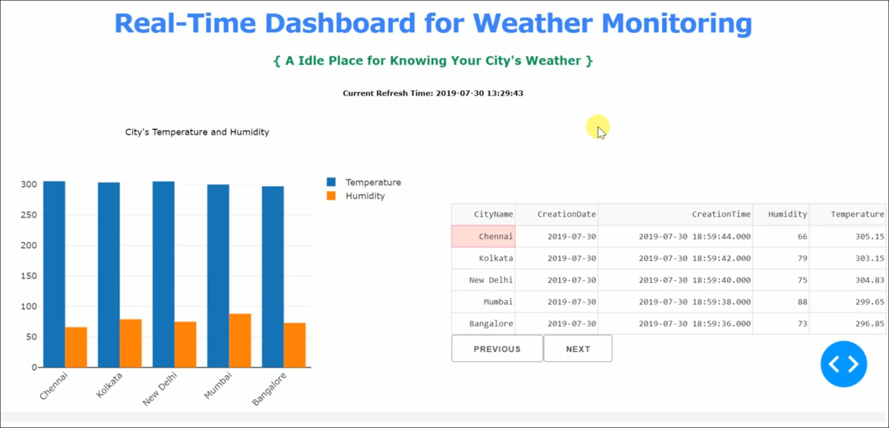
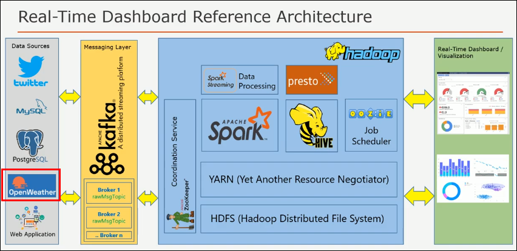
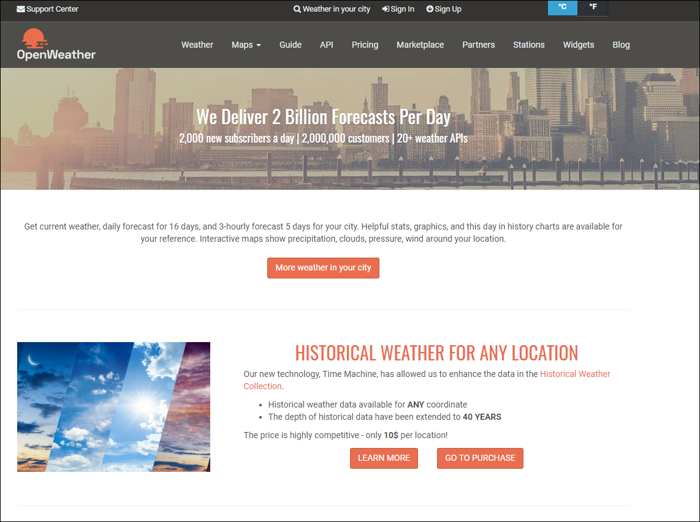
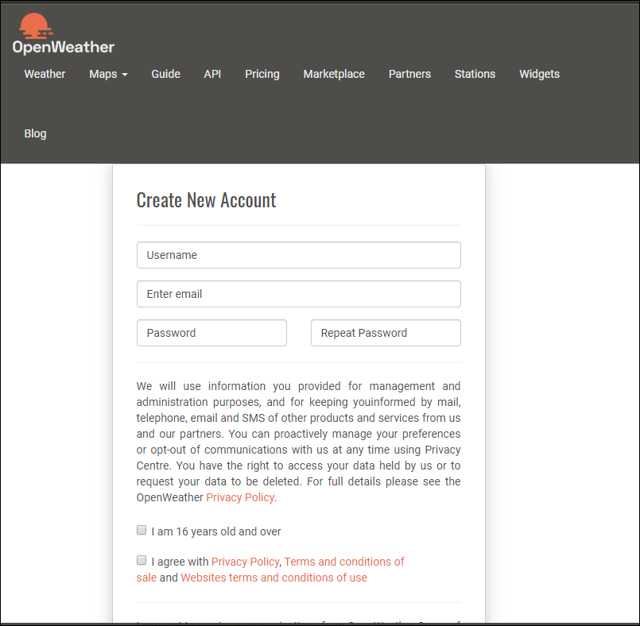
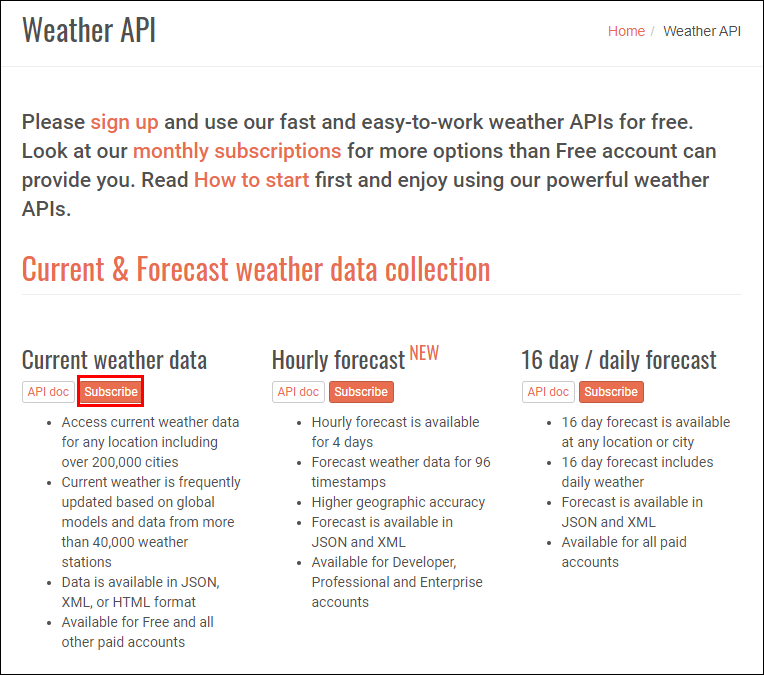
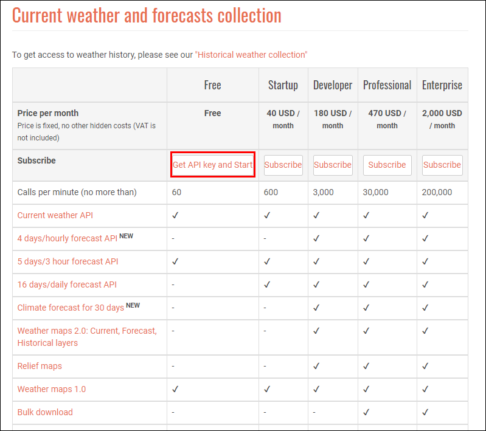
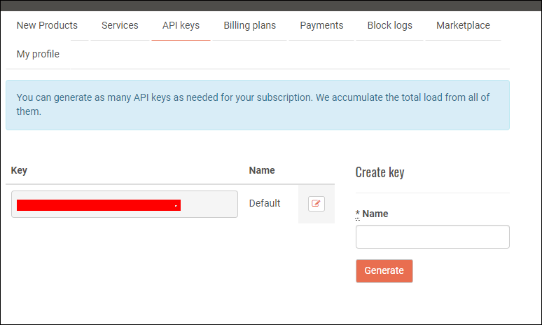

# Building Real-time Dashboard(1) - Weather Info
> 이번에는 각 도시들의 날씨정보를 실시간으로 받아서 웹에서 대시보드 형태로 출력해주는 미니 프로젝트를 진행해보겠습니다

## Architecture and Result
> 이번에 시작할 프로젝트의 전체 아키텍처와 예상 결과물 입니다   



---

## Pre-Requesites
> 실시간 날씨정보 대시보드 구축을 위한 사전준비작업

### Open Weather API key 획득하기
  

- [OpenWeather](https://openweathermap.org)에서 날씨 정보 획득을 위한 API 얻기
  

- Sign-up First
  
  

- Sign-up 후에 'Subscribe' 클릭
  
  

- Get Free Api key

  
  

---
  
### Kafka Producer with Python
- 파이썬으로 카프카 프로듀서 생성 및 API 호출로 날씨정보 GET!
  
- 'Kafka_producer.py' 파일 생성

- 코드작업
  ```python
    # 필요 패키지 import
    import time
    import json
    from kafka import KafkaProducer
    import requests

    # kafka broker 서버 (local 서버 사용)
    kafka_bootstrap_servers = '127.0.0.1:9092'
    # topic name (미리 생성해둔 토픽이름 입력)
    kafka_topic_name = 'weatherinfo'

    # producer 객체 생성
    producer = KafkaProducer(bootstrap_server = kafka_bootstrap_servers,
                            value_serializer = lambda v: json.dumps(v).encode('utf-8'))

    json_message = None
    city_name = None
    temperature = None
    humidity = None
    openweathermap_api_endpoint = None
    appid = None

    # 날씨 정보 Json 형태로 받아오기
    def get_weather_detail(openweathermap_api_endpoint):
        # api 호출 & get response
        api_response = requests.get(openweathermap_api_endpoint)
        # json 형태로 변환
        json_data = api_response.json()
        # 필요 정보만 저장
        city_name = json_data['name']
        humidity = json_data['main']['humidity']
        temperature = json_data['main']['temp']
        json_message = {'CityName': city_name, 'Temperature': temperature, "Humidity": humidity,
                        'CreationTime': time.strftime('%Y-%m-%d %H:%M:%S')}

        return json_message


    def get_appid(appid):


    while True:
        # 날씨 정보 가져올 도시
        city_name = 'Seoul'
        appid = get_appid(appid)
        # 발급받은 api 입력, 날씨 확인할 'city_name' 입력
        openweathermap_api_endpoint = 'http://api.openweathermap.org/data/2.5/weather?appid=' + appid + '&q=' + city_name
        # 'get_weather_detail' 함수로 가져온 json 형태의 날씨정보 입력
        json_message = get_weather_detail(openweathermap_api_endpoint)
        # 지정된 kafka topic의 프로듀서로 메세지 전송 
        producer.send(kafka_topic_name, json_message)
        print('Published message 1: ' + json.dumps(json_message))
        print('Wait for 2 seconds ...')
        # 2초간 정지
        time.sleep(2)

        city_name = 'Busan'
        appid = get_appid(appid)
        openweathermap_api_endpoint = 'http://api.openweathermap.org/data/2.5/weather?appid=' + appid + '&q=' + city_name
        json_message = get_weather_detail(openweathermap_api_endpoint)
        producer.send(kafka_topic_name, json_message)
        print('Published message 1: ' + json.dumps(json_message))
        print('Wait for 2 seconds ...')
        time.sleep(2)

        city_name = 'Daegu'
        appid = get_appid(appid)
        openweathermap_api_endpoint = 'http://api.openweathermap.org/data/2.5/weather?appid=' + appid + '&q=' + city_name
        json_message = get_weather_detail(openweathermap_api_endpoint)
        producer.send(kafka_topic_name, json_message)
        print('Published message 1: ' + json.dumps(json_message))
        print('Wait for 2 seconds ...')
        time.sleep(2)
    ```

